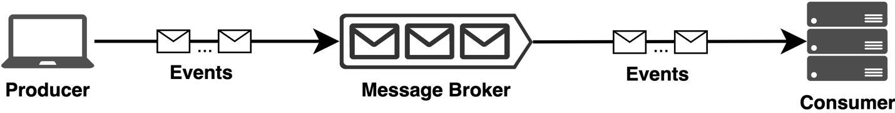

An event-driven architecture consists of several components:

1. Producer: for producing events.
2. Message Broker: a component between producer and consumer. It is used to receive and distribute events to different consumers. The advantage of using a broker is that components are decoupled, and events can be processed asynchronously.
3. Consumer: for receiving and processing events.

There are some design patterns for event-driven architecture:

### EventBridge + EventBridge Rules

### SNS + SQS

